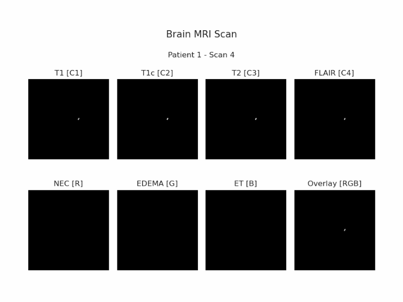

<a name="readme-top"></a>

<!-- PROJECT SHIELDS -->
[![Forks][forks-shield]][forks-url]
[![Stargazers][stars-shield]][stars-url]
[![Issues][issues-shield]][issues-url]
[![MIT License][license-shield]][license-url]
<!-- [![LinkedIn][linkedin-shield]][linkedin-url]
[![Gmail][gmail-shield]][gmail-url] -->

<!-- PROJECT LOGO -->
<br />
<div align="center">
  <a href="https://github.com/marcotallone/deep-learning-project">
    
  </a>

<h2 align="center">Multi-Model Approach for Brain Tumor Classification and Segmentation</h2>
<h4 align="center">Deep Learning Course Exam Project</h4>
<h4 align="center">SDIC Master Degree, University of Trieste (UniTS)</h4>
<h4 align="center">2024-2025</h4>

  <p align="center">
    A deep learning project for brain tumor classification and segmentation on MRI images using CNN, U-Net, and VIT models.
    <br />
    <br />
    <table>
      <tr>
        <td><a href="./presentation/presentation.pdf"><strong>Presentation</strong></a></td>
        <td><a href="https://github.com/marcotallone/deep-learning-project/issues"><strong>Report bug</strong></a></td>
        <td><a href="https://github.com/marcotallone/deep-learning-project/issues"><strong>Request Feature</strong></a></td>
    </table>
</div>

<!-- TABLE OF CONTENTS -->
<div style="width: 360px; text-align: center; border: 2px solid currentColor; padding: 10px 10px 10px 10px; border-radius: 10px; margin: auto;">
  <h4>📑 Table of Contents</h4>
  <ul style="list-style-type: none; padding: 0;">
    <li><a href="#students-info">Students Info</a></li>
    <li><a href="#about-the-project">About The Project</a></li>
    <li><a href="#getting-started">Getting Started</a></li>
    <li><a href="#usage">Usage Examples</a></li>
    <li><a href="#datasets-description">Datasets Description</a></li>
    <li><a href="#models-description">Models Description</a></li>
    <li><a href="#performance-assessment">Performance Assessment</a></li>
    <li><a href="#conclusions">Conclusions</a></li>
    <li><a href="#contributing">Contributing</a></li>
    <li><a href="#license">License</a></li>
    <li><a href="#references">References</a></li>
    <li><a href="#acknowledgments">Acknowledgments</a></li>
  </ul>
</div>
</br>

<!-- STUDENTS INFO-->
## Students Info

| Name | Surname | Student ID | UniTS mail | Google mail | Master |
|:---:|:---:|:---:|:---:|:---:|:---:|
| Stefano | Lusardi | SM3600001 | <stefano.lusardi@studenti.units.it> | <stefanosadde@gmail.com> | **SDIC** |
| Marco | Tallone | SM3600002 | <marco.tallone@studenti.units.it> | <marcotallone85@gmail.com> | **SDIC** |
| Piero | Zappi | SM3600004 | <piero.zappi@studenti.units.it> | <piero.z.2001@gmail.com> | **SDIC** |

<p align="right">(<a href="#readme-top">back to top</a>)</p>

<!-- ABOUT THE PROJECT -->
## About The Project

Deep learning models are widely used in medical imaging for their ability to learn complex patterns and features from images. In particular, convolutional neural networks (CNNs) have for long time been the most common models used for image **classification**, i.e. the task of assigning a label to an image and **segmentation**, i.e. the task of identifying and delineating the boundaries of objects in an image. In recent times, however, transformers models have been introduced in the field of computer vision and have shown to be very effective in the former tasks.\
This project aims to develop multiple deep learning models for brain tumor classification and segmentation on magnetic resonance imaging (MRI) images using CNN, U-Net, and VIT models in order to compare their performance as well as their strengths and weaknesses.\
Given an input MRI image, the **classification** task in this context consists in predicting the type of tumor present in the scan if any. Among the possible tumor classes found in the adopted dataset, the implemented networks were trained to classify between *glioma*, *meningioma*, *pituitary*, and *no tumor* classes.\
On the other hand, the **segmentation** task consists in identifying different tumor regions in input MRI images. In this case, in fact, the dataset consisted of images labelled with multiple masks highlighting *necrotic and non-enhancing tumour core (NCR/NET)*, *edema (ED)*, and *enhancing tumour (ET)* regions respectively.\
For the development of the models, the following two datasets have been used:

- For the **classification** task, the [Brain Tumor MRI Dataset](https://www.kaggle.com/datasets/masoudnickparvar/brain-tumor-mri-dataset) has been used.
- For the **segmentation** task, the [BraTS 2020 Dataset](https://www.kaggle.com/datasets/awsaf49/brats2020-training-data) has been used.

With the data at our disposal, we have developed the following models:

- For the **classification** task:
  - [Customly developed CNN](./models/custom_cnn.py) model
  - [`AlexNet`](./models/alexnet.py) model
  - [`VGG-16`](./models/vgg16.py) model
  - [`VIT`](./models/vit.py) model

- For the **segmentation** task:
  - [`ClassicUNet`](./models/classic_unet.py) model
  - [`ImprovedUNet`](./models/improved_unet.py) model
  - [`AttentionUNet`](./models/attention_unet.py) model

All the implemented models come with trained weights foundable in the [`saved_models`](./models/saved_models) folder as well as evaluated performance metrics in the [`saved_metrics`](./models/saved_metrics) folder.\
Further details about the datasets and the implemented models are given below, after installation instructions, dependencies requirements and usage examples.

### Project Structure

The project is structured as follows:

```bash
.
├──📁 datasets              # Dataset folders
│  ├──⏬ download.py        # Datasets download script 
│  ├──📁 classification     # Classification data
│  └──📁 segmentation       # Segmentation data (BraTS2020)
├──🖼️ images                # Other images
├──📁 jobs                  # SLURM Jobs
│  ├── cnn.job
│  ├── vit.job
│  └── unet.job
├── LICENSE                 # License
├──🤖 models                # Models implementations
│  ├── alexnet.py
│  ├── custom_cnn.py
│  ├── vit.py
│  ├── vgg16.py
│  ├── attention_unet.py
│  ├── classic_unet.py
│  ├── improved_unet.py
│  ├──📁 saved_metrics      # Performance metrics
│  └──📁 saved_models       # Saved model weights
├──📓 notebooks             # Jupiter Notebooks
│  ├── segmentation.ipynb
│  └── classification.ipynb
├──📁 papers                # Research papers/References
├──🐍 pytorch-conda.yaml    # Conda environment
├──📜 README.md             # This file
├──📁 training              # Training scripts
│  └── unet_training.py
└──⚙ utils                 # Utility scripts
```
  
### Built With


<p align="right">(<a href="#readme-top">back to top</a>)</p>

<!-- GETTING STARTED -->
## Getting Started

### Requirements

There are no particular requirements for running the provided project scripts aside having installed a working and updated version of `Python` and `Jupyter Notebook` on your machine as well as having installed all the required libraries you can find in the scripts and notebooks imports.\
We developed the project with `Python 3.11`.\
Among the less common Python libraries used, we instead mention:

- `torch` version 2.4.1+cu121 for Neural Networks models
- `tqdm` version 4.66.5 for nice progress bars
- `safetensors` version 0.4.5 for safe tensors operations
- `h5py` version 3.11.0 for handling HDF5 files
- `kaggle` (API package) version 1.6.17
- `imutils` version 0.5.4 for image processing utilities
- `einops` version 0.8.0 for tensor manipulation

To quickly download the datasets, we provide a [`download.py`](./datasets/download.py) script that will download the datasets from the provided links and extract them in the `datasets` folder while also performing the necessary preprocessing steps. In order to correctly use the script you wil need to have installed the `kaggle` Python package and have a valid Kaggle API token in your home `.kaggle/` directory. More information on how to get the Kaggle API token can be found [here](https://www.kaggle.com/docs/api).

>[!WARNING]
> Downloading the datasets from Kaggle manually and placing them in the `datasets/` folder is also possible but mind that it might be necessary to update the paths to the data in all the scripts depending on how you named the folders and files.

Moreover, in case you want to attempt training the models using the provided SLURM jobs in a HPC cluster (such as [ORFEO](https://orfeo-doc.areasciencepark.it/)) you will of course also need the correct credentials and permissions to access the cluster and submit jobs.

### Installation

All the necessary libraries can be easily installed using the `pip` package manager.\
Additionally we provide a [conda environment `yaml` file](./pytorch-conda.yaml) containing all the necessary libraries for the project. To create the environment you need to have installed a working `conda` version and then create the environment with the following command:

```bash
conda env create -f pytorch-conda.yaml
```

After the environment has been created you can activate it with:

```bash
conda activate pytorch
```

In case you want to run the scripts in a HPC cluster these steps might be necessary. Refer to your cluster documentation for Python packages usage and installation. For completeness we link the relevant [documentation for the ORFEO cluster](https://orfeo-doc.areasciencepark.it/HPC/python-environment/) that we used for the project.

<p align="right">(<a href="#readme-top">back to top</a>)</p>

<!-- USAGE EXAMPLES -->
## Usage Examples

The [`notebooks/`](./notebooks) folder contains multiple Jupiter Notebooks with examples of how to use the implemented models for both classification and segmentation tasks.\
Alternatively you can run the training python scripts provided in the [`training/`](./training) folder from command line with:

```bash
python training/train_script.py
```

>[!WARNING]
> Remember to always run python scripts from the **root folder** of the project in order to correctly import the necessary modules and packages.

For an example on how to define and use one of the provided models refer to each model documentation in the [`models/`](./models) folder. For instance, defining a model can be as easy as shown in the following lines of the [`unet_training.py`](./training/unet_training.py) script:

```python
# Select and initialize the U-Net model
model: th.nn.Module = ClassicUNet(n_filters=N_FILTERS)
```

All the implemented modules have been fully documented with docstrings so always refer to the documentation for more information on how to use them.

<p align="right">(<a href="#readme-top">back to top</a>)</p>

<!-- DATASETS DESCRIPTION -->
## Datasets Description

### Brain Tumor MRI Dataset (Classification)

The [Brain Tumor MRI Dataset](https://www.kaggle.com/datasets/masoudnickparvar/brain-tumor-mri-dataset) is a dataset containing a total of 7023 images of human brain MRI images which are classified into 4 classes: glioma, meningioma, no tumor and pituitary. The dataset is divided into two folders, one for training and one for testing, each containing subfolders for each class. Hence, the main task proposed by this dataset is the implementation og machine learning algorithms for the (multi-class) classification of brain tumors from MRI images.


This dataset is the result of the combination of data originally taken from 3 datasets, mainly:

- [Figshare Brain Tumor Dataset](https://figshare.com/articles/dataset/brain_tumor_dataset/1512427)
- [Sartaj Brain Tumor Classification](https://www.kaggle.com/datasets/sartajbhuvaji/brain-tumor-classification-mri)
- [Br35H Brain Tumor Detection](https://www.kaggle.com/datasets/ahmedhamada0/brain-tumor-detection?select=no)

> [!NOTE]
> As a result of the combination, the original size of the images in this dataset is different as some images exhibit white borders while others don't. You can resize the image to the desired size after preprocessing and removing the extra margins. These operations are automatically done by the provided [`download.py`](./datasets/download.py) script that will uniform all images to 256x256 pixels images.

As stated above, after preprocessing all images are in `.jpg` format and have been resized to 256x256 resolution. However, due to the large amount of computation required to elaborate such images with our models, in most cases we shrinked the images down to 128x128 pixels. Moreover, the dataset comes already separated into training and testing sets, with the training set containing 5712 images and the testing set containing 1311 images, hence roughly a 80-20 split. After an initial analysis of the dataset, we found that the 4 classes present in the dataset have the following distribution:


Hence class inbalance is not evident neither in the training nor in the testing set.

### BraTS 2020 Dataset (Segmentation)

<!--  -->
<!-- <p align="center">
  
</p> -->

The [BraTS 2020 Dataset](https://www.kaggle.com/datasets/awsaf49/brats2020-training-data) is a dataset containing a total of 57195 multimodal magnetic resonance imaging (MRI) scans of of intrinsically heterogeneous (in appearance, shape, and histology) brain tumors, namely gliomas. The scans have been collected from a total of 369 patients, labelled as **"volumes"**. Each volume then consists of 155 horizontal **slices** of the brain, hence the total amount of data in the dataset is 369x155 = 57195 images.\
Furthermore, the scans of each brain slice are not simple images, but are actually multimodal MRI scans, meaning that the given images comes with 4 different channels, each representing a different MRI modality:

1. **T1-weighted (T1)**: A high resolution image of the brain's anatomy. It's good for visualising the structure of the brain but not as sensitive to tumour tissue as other sequences.
2. **T1-weighted post contrast (T1c)**: After the injection of a contrast agent (usually gadolinium), T1-weighted images are taken again. The contrast agent enhances areas with a high degree of vascularity and blood-brain barrier breakdown, which is typical in tumour tissue, making this sequence particularly useful for highlighting malignant tumours.
3. **T2-weighted (T2)**: T2 images provide excellent contrast of the brain's fluid spaces and are sensitive to edema (swelling), which often surrounds tumours. It helps in visualizing both the tumour and changes in nearby tissue.
4. **Fluid Attenuated Inversion Recovery (FLAIR)**: This sequence suppresses the fluid signal, making it easier to see peritumoral edema (swelling around the tumour) and differentiate it from the cerebrospinal fluid. It's particularly useful for identifying lesions near or within the ventricles.

The original data also have a **mask** associated to each slice. In fact, all the scans have been segmented manually, by one to four raters, following the same annotation protocol, and their annotations were approved by experienced neuro-radiologists. These annotations highlight areas of interest within the brain scans, specifically focusing on abnormal tissue related to brain tumours. In particular, each mask comes with 3 channels:

1. <span style="color: red;"><b>Necrotic and Non-Enhancing Tumour Core (NCR/NET)</b></span>: This masks out the necrotic (dead) part of the tumour, which doesn't enhance with contrast agent, and the non-enhancing tumour core.
2. <span style="color: green;"><b>Edema (ED)</b></span>: This channel masks out the edema, the swelling or accumulation of fluid around the tumour.
3. <span style="color: blue;"><b>Enhancing Tumour (ET)</b></span>: This masks out the enhancing tumour, which is the region of the tumour that shows uptake of contrast material and is often considered the most aggressive part of the tumour.

The main task proposed by this dataset is therefore the implementation of machine learning algorithms for the segmentation of brain tumours from MRI images. However the dataset also comes with metadata information for each volume, such as the patient's age, survival days, and more. This allows for the development of more complex models that can for instance predict the patient's life expectancy from the tumour segmentation itself.\
The original scans are available in `HDF5` (`.h5`) format to save memory space and to speed up the data loading process. The provided [`download.py`](./datasets/download.py) script will automatically download and extract the data in the correct folder.\
As shown in the implemented Python notebooks, data can be loaded as multi-channel images and each channel, both for the input scan and for the ground truth mask, can be visualized independently as shown in the animated GIF below which represents some the 155 scans for the first patient as well as the overlay of the 3 masks channel in the last picture.

<!--  -->
<p align="center">
  
</p>

After preprocessing images and masks for each channel, these assume a final size of 240x240 pixels.\
As stated in the original dataset description, the usage of the dataset is free without restrictions for research purposes, provided that the necessary references [<a href="#ref1">1</a>, <a href="#ref2">2</a>, <a href="#ref3">3</a>, <a href="#ref4">4</a>, <a href="#ref5">5</a>] are cited.

<p align="right">(<a href="#readme-top">back to top</a>)</p>

<!-- MODELS DESCRIPTION -->
## Models Description

### Classification Models

#### Convolutional Neural Network (CNN) Model

As previously stated, we developed a **CNN model** to perform the classification task on the Brain Tumor MRI Dataset. The model was implemented starting from the AlexNet architecture presented in the original paper [*ImageNet Classification with Deep Convolutional Neural Networks*](./papers/AlexNet.pdf) by *Krizhevsky et al.* [<a href="#ref6">6</a>] and then simplified to improve its performance. The model is composed of four convolutional layers, each followed by a Mish activation function and a max pooling operation. Each convolutional layer has different channel sizes and kernel sizes to extract different features from the input images, as well as different strides and padding to control the output size. Before applying the activation function, batch normalization layers are added to speed up the training and improve the model's generalization capabilities. The output of the last convolutional layer is flattened and passed through three fully connected layers with a Mish activation function and a dropout layer to prevent overfitting. The last fully connected layer outputs the final prediction of the model.\
The model performs the classification task by taking in input the MRI scans of shape 128x128x3 and outputs a prediction of the class of the tumor. The model is trained using the cross-entropy loss function and the Adam optimizer, along with a learning rate scheduler to improve the training process. L2 regularization is also applied to the model's parameters to prevent overfitting.\
Further implementation specific details can be found in the [`custom_cnn.py`](./models/custom_cnn.py) script. Additionally, for comparison purposes explained below, we also provide an equivalent implementation of the original **AlexNet model** without changes in the [`alexnet.py`](./models/alexnet.py) script and of the **VGG-16 model** in the [`vgg16.py`](./models/vgg16.py) script.

#### VIT Model

A **Vision Transformer (VIT)** model has been implemented to perform the classification task on the Brain Tumor MRI Dataset. The core ideas to imlement such model were taken from the original paper [*An Image is Worth 16x16 Words: Transformers for Image Recognition at Scale*](./papers/VIT-Original.pdf) by *Dosovitskiy et al.* [<a href="#ref7">7</a>] and [*Image Classification Based on Vision Transformer*](./papers/VIT-Tumor-Classification.pdf) by *A. A. M. Omer* [<a href="#ref8">8</a>].\
The model's architecture is composed of the following components:

- **Patch Embeddings**: the input image is divided into patches of size 16x16 pixels; each patch is then flattened and projected into a higher-dimensional space using a linear layer.
- **Positional Encodings**: positional encodings are added to the patch embeddings to provide the model with information about the spatial relationships between the patches. A class token is also added to the sequence of embeddings to represent the entire image.
- **Transformer Encoder**: the patch embeddings are passed through a stack of transformer encoder layers. Specifically, the model has 10 transformer encoder layers, each composed of a multi-head self-attention mechanism followed by a feedforward neural network. Layer normalization and residual connections are applied after each encoder layer to stabilize the training process and improve the model's performance.
- **Dropout**: dropout layers are used throughout the model to prevent overfitting and improve the model's generalization capabilities by randomly setting a fraction of the input units to zero during training.
- **Classification Head**: the output of the final transformer encoder layer is passed through a classification head; in particular, this head consists of a layer normalization, a linear layer to map the encoded features to the number of classes, and a dropout layer to further prevent overfitting.

Also this model performs the classification task by taking in input the MRI scans of shape 128x128x3 and outputs a prediction of the class of the tumor. The model is trained using the cross-entropy loss function and the Adam optimizer, along with a learning rate scheduler to improve the training process. L2 regularization is also applied to the model's parameters to prevent overfitting.\
Once again, additional implementation specific details can be found in the [`vit.py`](./models/vit.py) script.

#### Comparison

The comparison between the models has been done considering accuracy, loss and confidence in the training. For what concerns the test set, which gives more interesting scores to be compared, we considered accuracy and confidence.
Confidence gives us a measure of how much the model is sure of the prediction it is making. It is calculated passing the outputs of the model through a softmax function and extracting the maximum value, which is the probability of the class predicted by the model. The higher the confidence, the more the model is sure of the prediction it is making.

### Segmentation Models

As previously anticipated 3 models have been implemented to perform the segmentation task on the BraTS 2020 dataset. These models are all based on the U-Net architecture. U-Net models consist in an **encoder** part, which compresses input images into a lower dimensional representation, and a symmetrical **decoder** part, which expands the compressed representation back to the original image size. The encoder part is usually composed of a series of convolutional layers with pooling layers in between, while the decoder part is composed of a series of convolutional layers with upsampling layers in between. Between the encoder and the decoder lies the **bottleneck** layer, which elaborates the most abstract representation of the input data and acts as a bridge between the two parts.\
The main difference between the 3 models described below lies in the way the encoder and decoder parts are implemented and how the skip connections are managed.

#### Classic U-Net Model

The first implemented U-Net model is an adaptation of the one proposed by *Ronneberger et al.* in their original paper [*U-Net: Convolutional Networks for Biomedical Image Segmentation*](./papers/U-Net-CNN.pdf) [<a href="#ref9">9</a>].
The model is schematically depicted in the figure below while the full implementation can be found in the [`classic_unet.py`](./models/classic_unet.py) script.


<!-- TODO: re-draw this image in tikz as the model it's not exactly like the one in the paper -->

In short, this model consists of 4 encoder blocks and, symmetrically, 4 decoder blocks connected by a bottleneck layer.\
Each encoder block is composed of 2 convolutional layers that perform a same convolution operation with kernels of size 3, followed by a ReLU activation function. Between one encoder block and the next the number of channels doubles every time, and a max pooling operation is then performed to reduce the spatial dimensions of the input data. The first encoder blocks, in fact, converts the 4 channels of the input images into the `n_filters` channels selected when the model is instantiated (in the original paper `n_filters=64`). The overall number of parameters in the model is of course decided by the value selected for this variable.\
Then a bottleneck layer follows and performs once again some same convolutions before the upscaling phase.\
The decoder is instead composed of the 4 decoder blocks which also perform same convolutions again with kernel size of 3 and ReLU non-linearities, but this time are alterated by bilinear upsampling operations to bring back the image to the original size.\
As portrayed by the gray arrows in the above image, skip connections are implemented from each encoder block to the symmetrical decoder counterpart to facilitate the training process. The skip connections are implemented by concatenating the output of the encoder block with the input of the decoder block.\
In our implementation, the model performs the segmentation task by taking in input the MRI scans of shape 240x240x4 and outputs a mask prediction of shape 240x240x3 to be compared with the ground truth mask layers described above.

#### Improved U-Net

As previously stated the total number of parameters of the previous model depends on the choice of the `n_filters` variable. However, in general, this number easily surpasses the milion parameters mark (e.g. setting `n_filters=16` already results in 1,375,043 parameters) which directly impacts training performace and inhibits possible improvements.\
To address this issue, we implemented a second U-Net model that we called `ImprovedUNet` which aims to reduce the number of parameters while maintaining the same performance, if not improving it. The model starts from the same base architecture of the previous one but has some improvements taken from ideas in different research papers. In particular this model differs from the previous in the following ways:

- **Separable Convolutions**: Instead of using the standard convolutional layers, this model uses separable convolutions, factorized in depthwise and pointwise convolutions. [<a href="#ref10">10</a>]
- **Batch Normalization**: Batch normalization layers have been added after each convolutional layer to speed up training and improve the model's generalization capabilities.
- **Larger Kernel Size**: as found by *Liu et al.* in [*A ConvNet for the 2020s*](./papers/Modern-CNNs.pdf) [<a href="#ref11">11</a>] using larger kernel sizes can improve CNNs performance. In particular the authors state that "*the benefit of larger kernel sizes reaches a saturation point at 7x7*".
- **Inverse Bottleneck**: The bottleneck layer has been replaced by an inverse bottleneck layer that first expands the number of channels before compressing them back to the original size. [<a href="#ref12">12</a>]
- **Additive Skip Connections**: Instead of concatenating the skip connections, this model uses an additive skip connection that sums the output of the encoder blocks with the decoder blocks.

These improvements significantly contribute in reducing the total numer of parameters (with `n_filters=16` the model now has 799,075 parameters). The model performs the segmentation task just like the previous one.\
The full implementation of the model can be found in the [`improved_unet.py`](./models/improved_unet.py) script.

#### Attention U-Net

The final model proposed for the segmentation task tries to incorporate in the U-Net architecture the **attention** mechanism typical of transformer models. The model, called `AttentionUNet`, is based on the paper [*Attention U-Net: Learning Where to Look for the Pancreas*](./papers/Attention-U-Nets.pdf) [<a href="#ref13">13</a>] by *Oktay et al.*. The model is schematically depicted in the figure below while the full implementation can be found in the [`attention_unet.py`](./models/attention_unet.py) script.


This model builds on top of the improvements already introduced in the previous one and adds the attention mechanism to the skip connections. The basic idea is to give the network the possibility to learn where to focus its attention when performing the segmentation task and hence giving higher priority to certain regions of the input images, possibly where the tumours are more often found. In practice this is done by implementing a *soft attention* mechanism for which, at each skip connection, the model learns a weight for each pixel of the input image. These weights are then used to multiply the output of the encoder block before summing it to the output of the decoder block. Accordingly, areas of high interest will have higher weights associated while less important areas will have lower weights. These weights are of course added parameters to the model and can be learned during training.\
The introduction of this mechanism should, in general, be beneficial for U-Nets model and it's possible to intuitively understand why. If we look at the classical U-Net architecture we can say that the *encoder* has a very good understanding of the spatial context of the input image as it deals with the original input representation and compresses it into a lower dimensional representation. On the other hand, the *decoder* has good feature representation as the input that travel through the network has been compressed and, ideally, it's most abstract representation is passed to the decoder by the bottleneck layer. However, the decoder has poor spatial representation as this is imprecisely recreated during the upsampling phase (in our case with bilinear upsampling). To counteract this problem, the U-Net uses skip connections that combine spatial information from the downsampling path of the encoder with the upsampling path. However, this brings across many redundant low-level feature extractions, as feature representation is poor in the initial layers. Here, the previously described attention mechanism should help the model ignore these redundant features and only focus on the most important ones.\
In practice, this mechanism is implemented as **attention gates** at the skip connections of the decoder part as shown above. Each attention gate, depicted in the image below, takes two inputs:

- the *query* or *gate* tensor **g** derived from the decoder feature map, i.e. from the lower resolution representation of the input image which should however have better feature representation as the input has travelled deeper into the network and has been compressed by the bottleneck layer
- the *key* tensor **x** taken from the encoder feature map of higher resolution which has better spatial representation but poorer feature representation


From a transformer point of view, the task is basically **to extract the regions in the encoder's features that are relevant to the query from the decoder**. The query and the key interact to produce the *attention map* which highlights areas where to focus on. The latter is produced by aligning the query tensor to the key one: this results in a set of weights that represent the importance of each of the decoder's features in the encoder's output.\
This attention map the acts on the encoder's output **x** itself (the **value**) since it's applied to this value through element-wise multiplication that scales the features accordingly. Features that are considered relevant by the attention map (high weights) are emphasized, while others (low weights) are diminished.
In summary, this produces a weighted feature representation where the attention is directed toward the most informative parts of the input, hence refining the information flow in the network and improving the quality of the segmentation output.\
As it's possible to see in the animation below, these attention maps are learned during the training phase so the hope is that the models learns to pay attention to the most important parts of the input images, i.e. the brain or even more precisely the tumour regions as it happens in maps 1 and 2 below although it seems in this case that the model also picks parts of the surrounding dark background with high attention.


Moreover, all of these benefits come with a limited increase in the number of parameters to pay (with `n_filters=16` the model now has 843,319 parameters), making this model the most efficient of the three.

<p align="right">(<a href="#readme-top">back to top</a>)</p>

<!-- PERFORMANCE ASSESSMENT -->
## Performance Assessment

### Classification Models

In the following table a summary of the performance metrics measured for the classification models at the end of their training is presented. The metrics are calculated on both the training and test sets and are averaged over the entire dataset. The metrics considered are:

- **Loss**: the average loss
- **Accuracy**: the average accuracy
- **Confidence**: the average confidence in the most probable prediction: basically the average of the maximum value of the softmax output at each prediction

| Net | Training Loss | Training accuracy | Training confidence | Test accuracy | Test confidence |
|:---:|:---:|:---:|:---:|:---:|:---:|
| Custom Net | 3.6 E-03 | 1.0 | 1.0 | 0.99 | 1.0 |
| Alex | 1 E-04 | 1.0 | 1.0 | 0.92 | 1.0 |
| VGG16 | 7.1 E-07 | 1.0 | 1.0 | 0.94 | 1.0 |
| VIT | 0.26 | 0.9 | 0.92 | 0.88 | 0.93 |

### Segmentation Models

In the following plots a summary of the most important performance metrics measured for the segmentation models at the end of their training is presented. Each metric is computed pixel-wise comparing the binarized predicted masks and the ground truth masks. Additionally, these have been averaged for both each channel independently and then the average across all channel and all batches has been taked.\
The metrics considered are:

- **Dice Coefficient**: a measure of the overlap between two samples, ranging from 0 to 1 where 1 means perfect overlap
- **IoU (Jaccard Index)**: a measure of the similarity between two samples, ranging from 0 to 1 where 1 means perfect similarity
- **Accuracy**: the average accuracy measured pixel-by-pixel (pixel-wise) and then average across all pixels for each channel and then also across all channels
- **False Positive Rate (FPR)**: the average pixel-wise rate of false positives
- **False Negative Rate (FNR)**: the average pixel-wise rate of false negatives
- **Precision**: the average pixel-wise precision
- **Recall**: the average pixel-wise recall


> [!NOTE]
> You might not be able to correctly read the labels if you are using a light theme in your browser. Please consider switching to a dark theme or download the image to see the labels. We kindly apologize for the inconvenience. 🙏🏻

<p align="right">(<a href="#readme-top">back to top</a>)</p>

<!-- CONCLUSIONS -->
## Conclusions

In conclusion, this project aimed to develop and compare different models for the classification and segmentation of brain tumours from MRI images. The models were trained on two different datasets, the Brain Tumor MRI Dataset for the classification task and the BraTS 2020 Dataset for the segmentation task.\
We successfully implemented and trained a CNN model and a VIT model for the classification task, achieving high accuracy and confidence on the test set. For the segmentation task, we also acheved very good results with the U-Net models, especially with the Attention U-Net model for which it was also possible to visualize the attention maps learned during the training phase.\
As a final consideration, although we were very satisfied with our work, we would like to propose a few possible improvements or extensions of this project, starting fro some of the ideas that we did not implement (*but we might implement in the future*...). Among these we suggest:

- Improving the classification models capabilities to be able to work with the original image size of 256x256 pixels rather than the downscaled 128x128 pixels images and checking if the performance improves (*even though the obtained results are already very good*) or get worse.
- Collecting more data to train the VIT model for classification and check if the performance improves.
- Attempting transfer learning with the Vision Transformer model to see if the performance improves (*not clear from where to pick already trained models or where to apply it so might need some research*).
- Testing out different architectures for the segmentation task and compare them with U-Nets
- Training the U-Net models on the whole dataset rather than using just 50% of it to see if the performance improves or maybe if better attention maps are learned by the Attention U-Net model.
- Performing a more in-depth hyperparameter tuning for the improved and Attention U-Net models (*requires more computational resources*).
- Use the metadata information about patient's survival rate present in the segmentation dataset to predict the patient's life expectancy from the tumour segmentation itself. This regression task could be implemented either by extending the U-Net models with a final fully connected layer or by implementing a model that takes the U-Net predition as input and outputs the life expectancy. Such model could maybe be trained on the original masks and then tested on the predicted masks fro the U-Nets to see how good the predictions are.

<p align="right">(<a href="#readme-top">back to top</a>)</p>

<!-- CONTRIBUTING -->
## Contributing

Although this repository started as a simple university exam project, if you have a suggestion that would make this better or you attempted to implement one of the above mentioned improvements and want to share it with us, please fork the repo and create a pull request. You can also simply open an issue with the tag "enhancement" or "extension".\

1. Fork the Project
2. Create your Feature Branch (`git checkout -b feature/AmazingFeature`)
3. Commit your Changes (`git commit -m 'Add some AmazingFeature'`)
4. Push to the Branch (`git push origin feature/AmazingFeature`)
5. Open a Pull Request

<p align="right">(<a href="#readme-top">back to top</a>)</p>

<!-- LICENSE -->
## License

Distributed under the MIT License. See [`LICENSE`](./LICENSE) for more information.

<p align="right">(<a href="#readme-top">back to top</a>)</p>

<!-- REFERENCES -->
## References

<a id="ref1"></a>
[1] B. H. Menze, A. Jakab, S. Bauer, J. Kalpathy-Cramer, K. Farahani, J. Kirby, et al. "The Multimodal Brain Tumor Image Segmentation Benchmark (BRATS)", IEEE Transactions on Medical Imaging 34(10), 1993-2024 (2015) DOI: 10.1109/TMI.2014.2377694

<a id="ref2"></a>
[2] S. Bakas, H. Akbari, A. Sotiras, M. Bilello, M. Rozycki, J.S. Kirby, et al., "Advancing The Cancer Genome Atlas glioma MRI collections with expert segmentation labels and radiomic features", Nature Scientific Data, 4:170117 (2017) DOI: 10.1038/sdata.2017.117

<a id="ref3"></a>
[3] S. Bakas, M. Reyes, A. Jakab, S. Bauer, M. Rempfler, A. Crimi, et al., "Identifying the Best Machine Learning Algorithms for Brain Tumor Segmentation, Progression Assessment, and Overall Survival Prediction in the BRATS Challenge", arXiv preprint arXiv:1811.02629 (2018)

<a id="ref4"></a>
[4] S. Bakas, H. Akbari, A. Sotiras, M. Bilello, M. Rozycki, J. Kirby, et al., "Segmentation Labels and Radiomic Features for the Pre-operative Scans of the TCGA-GBM collection", The Cancer Imaging Archive, 2017. DOI: 10.7937/K9/TCIA.2017.KLXWJJ1Q

<a id="ref5"></a>
[5] S. Bakas, H. Akbari, A. Sotiras, M. Bilello, M. Rozycki, J. Kirby, et al., "Segmentation Labels and Radiomic Features for the Pre-operative Scans of the TCGA-LGG collection", The Cancer Imaging Archive, 2017. DOI: 10.7937/K9/TCIA.2017.GJQ7R0EF

<a id="ref6"></a>
[6]
Alex Krizhevsky, Ilya Sutskever, and Geoffrey E. Hinton. 2017. ImageNet classification with deep convolutional neural networks. Commun. ACM 60, 6 (June 2017), 84–90. <https://doi.org/10.1145/3065386>

<!-- @inproceedings{
dosovitskiy2021an,
title={An Image is Worth 16x16 Words: Transformers for Image Recognition at Scale},
author={Alexey Dosovitskiy and Lucas Beyer and Alexander Kolesnikov and Dirk Weissenborn and Xiaohua Zhai and Thomas Unterthiner and Mostafa Dehghani and Matthias Minderer and Georg Heigold and Sylvain Gelly and Jakob Uszkoreit and Neil Houlsby},
booktitle={International Conference on Learning Representations},
year={2021},
url={https://openreview.net/forum?id=YicbFdNTTy}
} -->
<a id="ref7"></a>
[7]
Dosovitskiy, A., Beyer, L., Kolesnikov, A., Weissenborn, D., Zhai, X., Unterthiner, T., Dehghani, M., Minderer, M., Heigold, G., Gelly, S., Uszkoreit, J., & Houlsby, N. (2021). An Image is Worth 16x16 Words: Transformers for Image Recognition at Scale. International Conference on Learning Representations. <https://openreview.net/forum?id=YicbFdNTTy>

<a id="ref8"></a>
[8]
Omer, A.A.M. (2024) Image Classification Based on Vision Transformer. Journal of Computer and Communications, 12, 49-59. <https://doi.org/10.4236/jcc.2024.124005>

<!-- @InProceedings{10.1007/978-3-319-24574-4_28,
author="Ronneberger, Olaf
and Fischer, Philipp
and Brox, Thomas",
editor="Navab, Nassir
and Hornegger, Joachim
and Wells, William M.
and Frangi, Alejandro F.",
title="U-Net: Convolutional Networks for Biomedical Image Segmentation",
booktitle="Medical Image Computing and Computer-Assisted Intervention -- MICCAI 2015",
year="2015",
publisher="Springer International Publishing",
address="Cham",
pages="234--241",
abstract="There is large consent that successful training of deep networks requires many thousand annotated training samples. In this paper, we present a network and training strategy that relies on the strong use of data augmentation to use the available annotated samples more efficiently. The architecture consists of a contracting path to capture context and a symmetric expanding path that enables precise localization. We show that such a network can be trained end-to-end from very few images and outperforms the prior best method (a sliding-window convolutional network) on the ISBI challenge for segmentation of neuronal structures in electron microscopic stacks. Using the same network trained on transmitted light microscopy images (phase contrast and DIC) we won the ISBI cell tracking challenge 2015 in these categories by a large margin. Moreover, the network is fast. Segmentation of a 512x512 image takes less than a second on a recent GPU. The full implementation (based on Caffe) and the trained networks are available at http://lmb.informatik.uni-freiburg.de/people/ronneber/u-net.",
isbn="978-3-319-24574-4"
} -->
<a id="ref9"></a>
[9]
Ronneberger, O., Fischer, P., & Brox, T. (2015). U-Net: Convolutional Networks for Biomedical Image Segmentation. In Nassir Navab, Joachim Hornegger, William M. Wells, & Alejandro F. Frangi (Eds.), Medical Image Computing and Computer-Assisted Intervention -- MICCAI 2015 (pp. 234–241). Springer International Publishing. <https://doi.org/10.1007/978-3-319-24574-4_28>

<!-- @article{DBLP:journals/corr/Chollet16a,
  author       = {Fran{\c{c}}ois Chollet},
  title        = {Xception: Deep Learning with Depthwise Separable Convolutions},
  journal      = {CoRR},
  volume       = {abs/1610.02357},
  year         = {2016},
  url          = {http://arxiv.org/abs/1610.02357},
  eprinttype    = {arXiv},
  eprint       = {1610.02357},
  timestamp    = {Mon, 13 Aug 2018 16:46:20 +0200},
  biburl       = {https://dblp.org/rec/journals/corr/Chollet16a.bib},
  bibsource    = {dblp computer science bibliography, https://dblp.org}
} -->
<a id="ref10"></a>
[10]
Chollet, F. (2016). Xception: Deep Learning with Depthwise Separable Convolutions. CoRR, abs/1610.02357. <http://arxiv.org/abs/1610.02357>

<!-- @misc{liu2022convnet2020s,
      title={A ConvNet for the 2020s}, 
      author={Zhuang Liu and Hanzi Mao and Chao-Yuan Wu and Christoph Feichtenhofer and Trevor Darrell and Saining Xie},
      year={2022},
      eprint={2201.03545},
      archivePrefix={arXiv},
      primaryClass={cs.CV},
      url={https://arxiv.org/abs/2201.03545}, 
} -->
<a id="ref11"></a>
[11]
Liu, Z., Mao, H., Wu, C.-Y., Feichtenhofer, C., Darrell, T., & Xie, S. (2022). A ConvNet for the 2020s. arXiv preprint arXiv:2201.03545. <https://arxiv.org/abs/2201.03545>

<!-- @article{DBLP:journals/corr/abs-1801-04381,
  author       = {Mark Sandler and
                  Andrew G. Howard and
                  Menglong Zhu and
                  Andrey Zhmoginov and
                  Liang{-}Chieh Chen},
  title        = {Inverted Residuals and Linear Bottlenecks: Mobile Networks for Classification,
                  Detection and Segmentation},
  journal      = {CoRR},
  volume       = {abs/1801.04381},
  year         = {2018},
  url          = {http://arxiv.org/abs/1801.04381},
  eprinttype    = {arXiv},
  eprint       = {1801.04381},
  timestamp    = {Tue, 12 Jan 2021 15:30:06 +0100},
  biburl       = {https://dblp.org/rec/journals/corr/abs-1801-04381.bib},
  bibsource    = {dblp computer science bibliography, https://dblp.org}
} -->
<a id="ref12"></a>
[12]
Sandler, M., Howard, A. G., Zhu, M., Zhmoginov, A., & Chen, L.-C. (2018). Inverted Residuals and Linear Bottlenecks: Mobile Networks for Classification, Detection and Segmentation. CoRR, abs/1801.04381. <http://arxiv.org/abs/1801.04381>

<!-- @article{DBLP:journals/corr/abs-1804-03999,
  author       = {Ozan Oktay and
                  Jo Schlemper and
                  Lo{\"{\i}}c Le Folgoc and
                  Matthew C. H. Lee and
                  Mattias P. Heinrich and
                  Kazunari Misawa and
                  Kensaku Mori and
                  Steven G. McDonagh and
                  Nils Y. Hammerla and
                  Bernhard Kainz and
                  Ben Glocker and
                  Daniel Rueckert},
  title        = {Attention U-Net: Learning Where to Look for the Pancreas},
  journal      = {CoRR},
  volume       = {abs/1804.03999},
  year         = {2018},
  url          = {http://arxiv.org/abs/1804.03999},
  eprinttype    = {arXiv},
  eprint       = {1804.03999},
  timestamp    = {Tue, 17 Sep 2019 14:15:15 +0200},
  biburl       = {https://dblp.org/rec/journals/corr/abs-1804-03999.bib},
  bibsource    = {dblp computer science bibliography, https://dblp.org}
} -->
<a id="ref13"></a>
[13]
Oktay, O., Schlemper, J., Le Folgoc, L., Lee, M. C. H., Heinrich, M. P., Misawa, K., Mori, K., McDonagh, S. G., Hammerla, N. Y., Kainz, B., Glocker, B., & Rueckert, D. (2018). Attention U-Net: Learning Where to Look for the Pancreas. CoRR, abs/1804.03999. <http://arxiv.org/abs/1804.03999>

<p align="right">(<a href="#readme-top">back to top</a>)</p>

<!-- ACKNOWLEDGMENTS -->
## Acknowledgments

- [Repository for the Deep Learning Course Labs/Practica (UniTS, Spring 2024)](https://github.com/emaballarin/deeplearning-units): for the Pytorch tutorials and the initial codebase
- [Best-README-Template](https://github.com/othneildrew/Best-README-Template?tab=readme-ov-file): for the README template
- [Freepik](https://www.flaticon.com/free-icons/machine-learning"): for the icons used in the README
- [PlotNeuralNet](https://github.com/HarisIqbal88/PlotNeuralNet): for the TikZ code to draw model's architectures

<p align="right">(<a href="#readme-top">back to top</a>)</p>

<!-- MARKDOWN LINKS & IMAGES -->
<!-- https://www.markdownguide.org/basic-syntax/#reference-style-links -->
[forks-shield]: https://img.shields.io/github/forks/marcotallone/deep-learning-project.svg?style=for-the-badge
[forks-url]: https://github.com/marcotallone/deep-learning-project/network/members
[stars-shield]: https://img.shields.io/github/stars/marcotallone/deep-learning-project.svg?style=for-the-badge
[stars-url]: https://github.com/marcotallone/deep-learning-project/stargazers
[issues-shield]: https://img.shields.io/github/issues/marcotallone/deep-learning-project.svg?style=for-the-badge
[issues-url]: https://github.com/marcotallone/deep-learning-project/issues
[license-shield]: https://img.shields.io/github/license/marcotallone/deep-learning-project.svg?style=for-the-badge
[license-url]: https://github.com/marcotallone/deep-learning-project/blob/master/LICENSE.txt
<!-- [linkedin-shield]: https://img.shields.io/badge/-LinkedIn-black.svg?style=for-the-badge&logo=linkedin&colorB=555
[linkedin-url]: https://linkedin.com/in/marco-tallone-40312425b -->
<!-- [gmail-shield]: https://img.shields.io/badge/-Gmail-black.svg?style=for-the-badge&logo=gmail&colorB=555
[gmail-url]: mailto:marcotallone85@gmail.com -->
